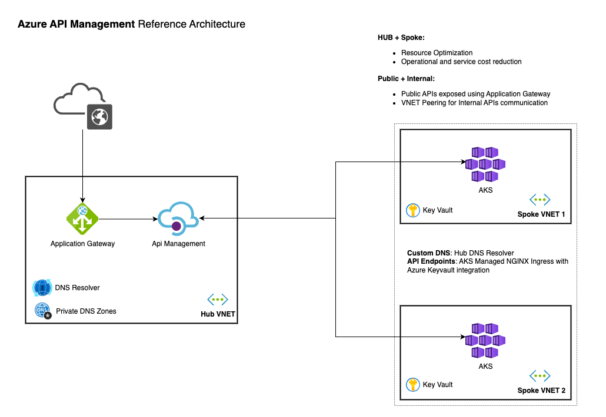

## About 

This project implements a reference architecture for the Azure API Management service with a central instance into a hub network to publish apis deployed in spoke networks, both publicly and privately.

It uses private link, private dns zones configurations and resource settings ready for at-scale, highly-available and secure by default scenarios.

## Reference Architecture



## Deploying the solution

#### Create a root CA certificate

```
$ openssl genrsa -out certs/ca.key 4096
```

```
$ openssl req -new -x509 -days 3650 -key certs/ca.key -out certs/ca.crt -config certs/ca.cnf
```

#### Create the API certificate

``` 
$ openssl ecparam -out certs/api.contoso.com.key -name prime256v1 -genkey
```

``` 
$ openssl req -new -sha256 -key certs/api.contoso.com.key -out certs/api.contoso.com.csr

Country Name (2 letter code) [AU]:BR
State or Province Name (full name) [Some-State]:SP
Locality Name (eg, city) []:
Organization Name (eg, company) [Internet Widgits Pty Ltd]:Contoso
Organizational Unit Name (eg, section) []:
Common Name (e.g. server FQDN or YOUR name) []:*.api.contoso.com
Email Address []:

Please enter the following 'extra' attributes
to be sent with your certificate request
A challenge password []:
An optional company name []:
```

```
$ openssl x509 -req -in certs/api.contoso.com.csr -CA certs/ca.crt -CAkey certs/ca.key -CAcreateserial -out certs/api.contoso.com.crt -days 365 -sha256
```

```
$ openssl pkcs12 -export -out certs/api.contoso.com.pfx -inkey certs/api.contoso.com.key -in certs/api.contoso.com.crt -certfile certs/ca.crt
```

#### Create the backend certificate

```
$ openssl ecparam -out certs/backend.contoso.com.key -name prime256v1 -genkey
```

```
$ openssl req -new -sha256 -key certs/backend.contoso.com.key -out certs/backend.contoso.com.csr

Country Name (2 letter code) [AU]:BR
State or Province Name (full name) [Some-State]:SP
Locality Name (eg, city) []:
Organization Name (eg, company) [Internet Widgits Pty Ltd]:Contoso
Organizational Unit Name (eg, section) []:
Common Name (e.g. server FQDN or YOUR name) []:*.backend.contoso.com
Email Address []:

Please enter the following 'extra' attributes
to be sent with your certificate request
A challenge password []:
An optional company name []:
```

```
$ openssl x509 -req -in certs/backend.contoso.com.csr -CA certs/ca.crt -CAkey certs/ca.key -CAcreateserial -out certs/backend.contoso.com.crt -days 365 -sha256
```

```
$ openssl pkcs12 -export -out certs/backend.contoso.com.pfx -inkey certs/backend.contoso.com.key -in certs/backend.contoso.com.crt -certfile certs/ca.crt
```

#### Deploy the infrastructure

Login to azure using azure-cli

```
$ export ARM_SUBSCRIPTION_ID=<subscription id>
$ az login
```

Deploy the infrastructure using terraform

```
$ cd terraform
$ terraform init
$ terraform plan
$ terraform apply
```

#### Deploy a sample API

Change the default ingressclass to internal

```
$ cd ../manifests
$ az aks get-credentials --resource-group apim-ref-rg --name aks-backend
$ az aks command invoke --resource-group apim-ref-rg --name aks-backend --command "kubectl apply -f nginx-internal-controller.yaml" --file nginx-internal-controller.yaml 
```

Create the API resources

Edit ```sample-api.yaml``` and change the ```kubernetes.azure.com/tls-cert-keyvault-uri``` value to the certificate URI from the command bellow.

```
$ az keyvault certificate show --vault-name ingress-controller-<suffix> --name backend-contoso-com --query "id" --output tsv
```

Apply the api manifest

```
$ az aks command invoke --resource-group apim-ref-rg --name aks-backend --command "kubectl apply -f sample-api.yaml" --file sample-api.yaml
```

Test the api

```
$ curl --cacert ../certs/ca.crt --resolve production.api.contoso.com:443:<app_gw_public_ip> https://production.api.contoso.com/hello 
```

## References

https://techcommunity.microsoft.com/blog/azurearchitectureblog/example-reference-network-topologies-for-api-management-in-private-mode-/3932001

https://learn.microsoft.com/en-us/azure/cloud-adoption-framework/ready/azure-best-practices/private-link-and-dns-integration-at-scale